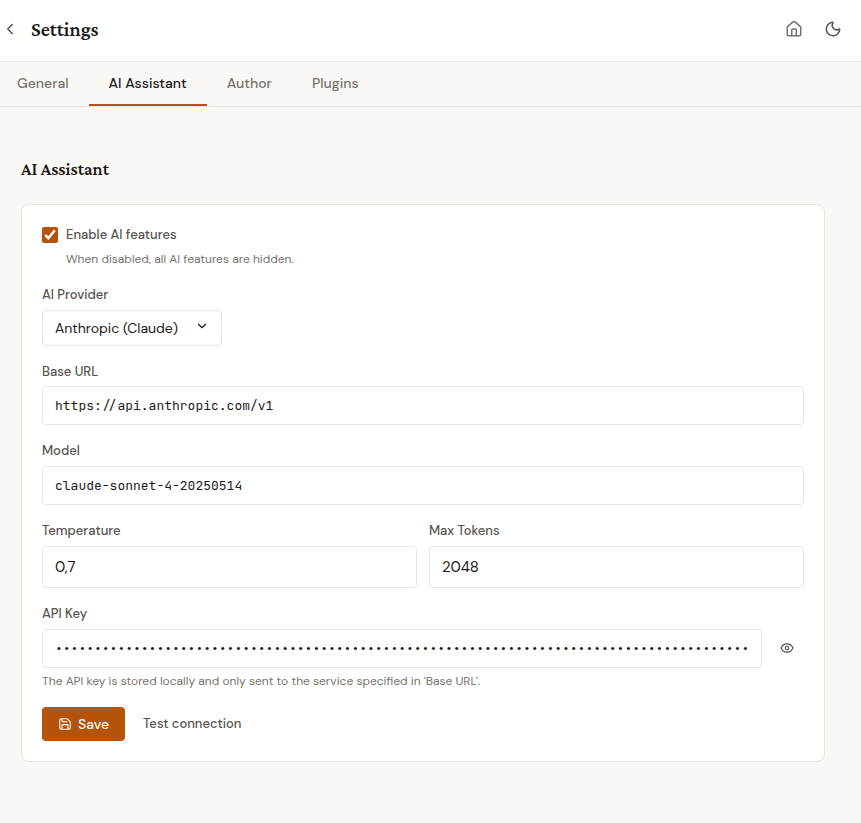

# KI-Assistent

Topos enthält einen optionalen KI-Assistenten, der beim Schreiben, Bearbeiten und Vermarkten hilft. Er unterstützt mehrere KI-Anbieter und funktioniert sowohl mit Cloud-Diensten als auch mit lokalen Modellen.

## Einrichten

1. Öffne **Einstellungen > Allgemein > KI-Assistent**
2. Aktiviere **KI-Funktionen aktivieren**
3. Wähle deinen Anbieter (Anthropic, OpenAI, Google Gemini, Mistral oder LM Studio)
4. Gib deinen API-Schlüssel ein (nicht nötig für LM Studio)
5. Klicke **Verbindung testen** zur Überprüfung

Beim ersten Start führt ein Einrichtungsassistent durch diese Schritte.

Der KI-Assistent ist standardmäßig deaktiviert. Dein Text wird nur an den KI-Anbieter gesendet, wenn du eine KI-Funktion ausdrücklich nutzt. Im Hintergrund wird nichts gesendet.

## Anbieter

| Anbieter | API-Schlüssel nötig | Hinweise |
|----------|---------------------|----------|
| Anthropic (Claude) | Ja | Hochwertige Schreibhilfe |
| OpenAI (GPT) | Ja | Weit verbreitet |
| Google (Gemini) | Ja | Kostenlose Stufe verfügbar |
| Mistral | Ja | Europäischer Anbieter |
| LM Studio | Nein | Läuft lokal auf deinem Computer, vollständig offline |

LM Studio ist ideal, wenn du KI-Hilfe nutzen möchtest, ohne deinen Text an einen Cloud-Dienst zu senden.

## Textvorschläge

Markiere im Editor einen Text und klicke den KI-Button in der Toolbar. Vier Modi stehen zur Verfügung:

- **Verbessern** - Grammatik korrigieren, Klarheit und Fluss verbessern
- **Kürzen** - den Text prägnanter machen
- **Erweitern** - mehr Details und Beschreibungen hinzufügen
- **Eigener Prompt** - eigene Anweisung eingeben

Die KI liefert einen Vorschlag. Klicke **Übernehmen** um die Auswahl zu ersetzen, oder **Verwerfen** um das Original zu behalten.

Die KI passt ihre Vorschläge an das Genre und die Sprache deines Buches an.

## Kapitel-Review

Klicke den **Review**-Tab im KI-Panel. Die KI analysiert das gesamte Kapitel und liefert einen strukturierten Markdown-Bericht, den du speichern und wieder öffnen kannst.

### Fokusmodi

Wähle genau einen Fokus, bevor du **Kapitel reviewen** anklickst:

- **Stil** - Schreibstil: Wortwahl, Satzvariation, Lesbarkeit, Stimmkonsistenz. Nutze diesen Modus, wenn die Story funktioniert, die Prosa aber geschliffen werden soll.
- **Konsistenz** - Widersprüche innerhalb des Kapitels: Fakten, Zeitlinie, Figurenmerkmale, Orte, Objektbeschreibungen. Fängt die kleinen "ihr Mantel war vor zwei Seiten blau, jetzt grün"-Fehler ab, bevor sie ein Leser entdeckt.
- **Testleser** - offenes Erstleser-Feedback: Was zieht rein, was zieht sich, was verwirrt, welche Fragen bleiben offen. Nutze diesen Modus, wenn das Kapitel fertig ist und du einen "frische Augen"-Durchgang willst.

Die vier Legacy-Fokuswerte (Kohärenz, Pacing, Dialog, Spannung) sind auf API-Ebene weiterhin verfügbar, tauchen aber nicht mehr im UI auf.

### Kostenschätzung

Der Start-Button zeigt eine grobe Schätzung der Input-Tokens und der USD-Kosten basierend auf Kapitellänge und konfiguriertem Modell (z.B. `~5k Tokens, ~$0.075`). Die Schätzung ist konservativ; die tatsächliche Nutzung liegt meist darunter. Ohne bekanntes Modell erscheint keine Kostenangabe.

### Nicht-Prosa-Kapitel

Für Kapiteltypen, die keine erzählende Prosa sind (Titelseite, Copyright, Inhaltsverzeichnis, Impressum, Index, Schmutztitel, Auch-vom-Autor, Nächster-Band, Call-to-Action, Endnoten, Literatur, Glossar), zeigt Topos eine kleine Warnung über dem Start-Button. Du kannst das Review trotzdem starten; das Feedback ist dann meist eingeschränkter als bei Prosa.

### Strukturiertes Ergebnis

Jedes Review nutzt die gleiche Struktur:

- **Zusammenfassung** - ein Satz zum Kapitelinhalt
- **Stärken** - was gut funktioniert, mit konkreten Verweisen
- **Vorschläge** - konkrete Verbesserungen mit Erklärungen
- **Gesamtbewertung** - eine kurze Einschätzung

Das Review berücksichtigt Genre, Sprache (alle 8 unterstützten UI-Sprachen) und den ausgewählten Kapiteltyp, so dass das Feedback zum jeweiligen Abschnitt passt (z.B. Pacing-Feedback für Thriller, minimale Ton-Hinweise bei einer Widmung, Compliance-Hinweise auf Copyright-Seiten).

### Persistenz + Download

Jedes Review wird als Markdown-Datei unter `uploads/{book_id}/reviews/` gespeichert, Dateiname nach dem Schema `{review-id}-{kapitel-slug}-{YYYY-MM-DD}.md`. Ein **Bericht herunterladen**-Button erscheint neben dem Ergebnis, so kannst du die Datei lokal sichern, in ein Schreib-Notizbuch legen oder an einen Commit hängen. Beim Löschen eines Kapitels werden die zugehörigen Review-Dateien automatisch mit aufgeräumt.

### Asynchroner Fortschritt

Große Kapitel brauchen 5-60 Sekunden. Das Review läuft als Hintergrund-Job; der Editor bleibt bedienbar, und eine rotierende Statusmeldung (in der Sprache deines Buches) zeigt den Fortschritt. Du kannst das KI-Panel mitten im Review schließen; sobald das Review fertig ist, taucht das Ergebnis beim erneuten Öffnen wieder auf.

## Marketing-Texte

Unter **Buch-Metadaten > Marketing** hat jedes Textfeld einen kleinen KI-Button:

- **Buchbeschreibung (Amazon)** - generiert einen HTML-Klappentext für Online-Shops
- **Rückseitentext** - knapper Text für die gedruckte Rückseite
- **Autorenbiografie** - Kurzbiografie in dritter Person
- **Keywords** - Suchbegriffe für Amazon KDP

Die KI nutzt Buchtitel, Autorname, Genre, Beschreibung und Kapitelüberschriften, um relevante Texte zu generieren. Du kannst das Ergebnis vor dem Speichern bearbeiten.

## Nutzungsverfolgung

Topos zählt, wie viele KI-Tokens jedes Buch verbraucht. Der aktuelle Stand und die geschätzten Kosten werden im Marketing-Tab angezeigt. So behältst du den Überblick über deine KI-Nutzung.

## Datenschutz

- KI-Funktionen sind standardmäßig deaktiviert
- Dein Text wird nur gesendet, wenn du einen KI-Button klickst
- Im Hintergrund wird nichts gesendet
- Der API-Schlüssel wird nur lokal gespeichert, nie weitergegeben
- LM Studio behält alles auf deinem Computer
