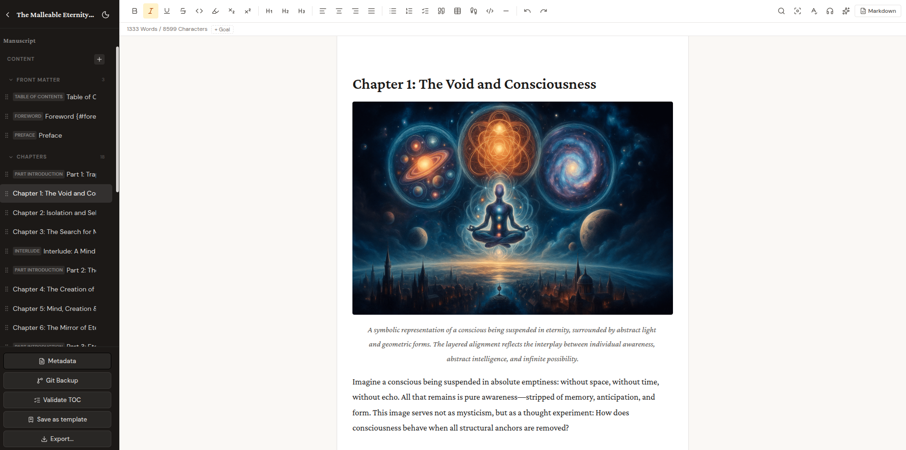

# Editor-Übersicht

## Der TipTap-Editor

Topos verwendet TipTap als Texteditor. TipTap ist ein moderner WYSIWYG-Editor, der auf ProseMirror basiert und in allen gängigen Browsern funktioniert. Du siehst deinen Text so, wie er später im Buch erscheinen wird, mit formatierten Überschriften, Listen, Bildern und Zitaten. Intern speichert Topos die Inhalte als TipTap-JSON, nicht als HTML oder Markdown. Beim Export werden die Inhalte automatisch in das Zielformat konvertiert.

## Toolbar

Am oberen Rand des Editors befindet sich die Toolbar mit 24 Schaltflächen für die gängigsten Formatierungen. Von links nach rechts findest du dort unter anderem: Fett, Kursiv, Durchgestrichen, Code, Überschriften (H1 bis H6), Aufzählungsliste, nummerierte Liste, Zitat, Trennlinie, Bild einfügen, Tabelle, Fußnote und Rückgängig/Wiederholen. Alle Funktionen sind auch über Tastenkürzel erreichbar (siehe Tastenkürzel-Seite). Wenn du den Mauszeiger über eine Schaltfläche hältst, zeigt ein Tooltip die zugehörige Aktion und das Kürzel an.

## Kapitel-Sidebar

Links neben dem Editor zeigt die Sidebar die Kapitelstruktur deines Buchs. Jedes Kapitel wird als Eintrag mit Titel und Kapiteltyp angezeigt. Du kannst:

- Neue Kapitel über den Plus-Button hinzufügen
- Die Reihenfolge per Drag-and-Drop ändern
- Kapitel durch Klick auswählen und bearbeiten
- Den Kapiteltyp ändern (Kapitel, Vorwort, Nachwort, Glossar, Anhang, etc.)
- Kapitel löschen (mit Bestätigung)

Die Kapiteltypen bestimmen, in welchem Abschnitt des exportierten Buchs ein Kapitel erscheint (Front-Matter, Hauptteil, Back-Matter).

## WYSIWYG und Markdown

Der Editor bietet zwei Modi: WYSIWYG (Standard) und Markdown. Im WYSIWYG-Modus arbeitest du visuell mit der Toolbar. Im Markdown-Modus siehst du den Rohtext in Markdown-Syntax und kannst ihn direkt bearbeiten. Beim Wechsel zwischen den Modi konvertiert Topos den Inhalt automatisch. Beachte, dass TipTap intern kein Markdown versteht. Beim Umschalten von Markdown zu WYSIWYG wird der Markdown-Text zu HTML konvertiert und als TipTap-JSON gespeichert.

## Autosave

Der Editor speichert deine Änderungen automatisch. Jede Änderung wird mit einem kurzen Verzögerung (Debounce) an das Backend gesendet und in der SQLite-Datenbank gespeichert. Du musst nicht manuell speichern. Der aktuelle Speicherstatus wird in der Statusleiste angezeigt.

## Schlüsselwörter im Metadaten-Tab

Im Reiter **Metadaten > Marketing** pflegst du Schlüsselwörter (Keywords) für dein Buch. Diese landen beim Export in den Amazon-KDP-Metadaten und helfen Lesern, dein Buch zu finden.

**Hinzufügen:** Tippe ein Schlüsselwort in das Eingabefeld und drücke Enter. Kommas werden nicht als Trenner akzeptiert, weil sie den Export brechen würden - jedes Schlüsselwort ist ein eigener Eintrag. Umgebender Whitespace wird automatisch entfernt, Duplikate werden case-insensitive abgelehnt.

**Bearbeiten:** Doppelklick auf einen Chip verwandelt ihn in ein Eingabefeld. Enter speichert die Änderung, Escape verwirft sie, ein Klick außerhalb speichert ebenfalls. Validierungsfehler (leer, zu lang, Komma enthalten, Duplikat) lassen den Edit-Modus offen mit rotem Rand, damit du direkt korrigieren kannst.

**Löschen und Rückgängig:** Das kleine X rechts an jedem Chip entfernt den Eintrag. Ein Toast unten rechts bietet fünf Sekunden lang einen Rückgängig-Button an, der das Schlüsselwort an seiner ursprünglichen Position wiederherstellt - nicht am Ende der Liste.

**Sortieren:** Drag-and-Drop per Grip-Handle (die kleinen Punkte links im Chip) sortiert die Schlüsselwörter um.

**Empfehlung und Hartlimit:** Amazon KDP empfiehlt maximal 7 Schlüsselwörter pro Buch. Sobald du den achten Eintrag hinzufügst, wird der Zähler warnfarben und ein Hinweis erklärt, dass andere Plattformen mehr erlauben - du wirst aber nicht blockiert. Bei 50 Schlüsselwörtern wird das Eingabefeld hart deaktiviert; das ist die absolute Obergrenze als Missbrauchs-Schutz. Einzelne Schlüsselwörter dürfen maximal 50 Zeichen lang sein.

**Speicherung:** Änderungen an den Schlüsselwörtern werden erst beim globalen "Speichern"-Button des Metadaten-Tabs persistiert. Wenn du den Tab ohne Speichern verlässt, gehen deine Änderungen verloren.

## HTML-Vorschau im Marketing-Tab

Drei Marketing-Felder akzeptieren HTML und besitzen einen Vorschau-Umschalter: **Buch-Beschreibung (HTML für Amazon)**, **Rückseitenbeschreibung** und **Autor-Bio (Rückseite)**. Standardmäßig ist die bearbeitbare Textarea aktiv. Mit dem Vorschau-Button oben rechts am Feld schaltest du zwischen Bearbeitungsmodus und gerenderter HTML-Vorschau um. So kannst du prüfen, wie deine Beschreibung mit Absätzen, Listen, fett gesetzten Stellen und ähnlichen Elementen tatsächlich aussehen wird, ohne den Export starten zu müssen. Die Vorschau wird sicher gerendert: gefährliches HTML (z.B. Skripte) wird vor der Anzeige entfernt.

