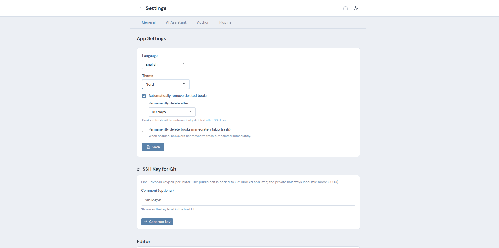
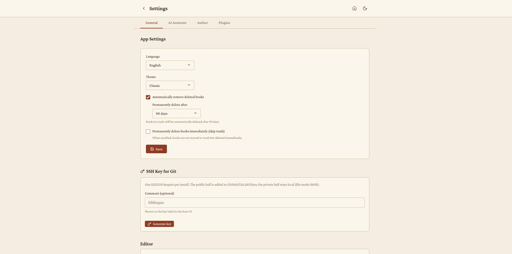
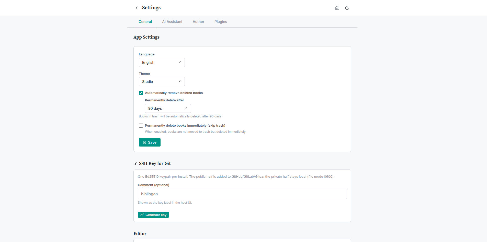

# Themes

MyApp bietet sechs Farbpaletten, jeweils in einer Hell- und einer Dunkel-Variante. Das Farbschema wird unter **Einstellungen > Anzeige** gewählt, die Hell/Dunkel-Umschaltung liegt auf dem Sonne/Mond-Icon in der Sidebar.

## Verfügbare Paletten

### Warm Literary *(Standard)*
Warme Creme- und Braun-Töne mit Crimson Pro als Serifen-Schrift. Die Originalpalette von MyApp, angelehnt an klassisches Druckpapier.

### Cool Modern
Kühle Blau-Grau-Töne mit Inter als serifenloser Schrift. Klares, modernes Layout für Autoren die einen nüchternen Look bevorzugen.

### Nord
Die beliebte Nord-Farbpalette in MyApp-Anpassung. Gedämpfte Pastelltöne, gut für lange Lesesitzungen.

### Klassisch *(neu)*
Papierhaftes Gefühl mit warmen beige-creme Tönen und Bordeaux-Akzent. Serif-Schrift (Crimson Pro) in Editor, Sidebar und UI. Der Editor hat zusätzlich eine Erst-Zeilen-Einrückung auf allen Absätzen außer dem ersten nach einer Überschrift - typografische Konvention für literarische Texte.

**Wann wählen:** Literarisches Schreiben, Roman, Belletristik. Für Autoren die von papier-ähnlichen Werkzeugen kommen.

### Studio *(neu)*
Dunkler, professioneller Look mit hohen Kontrasten und Mint/Teal-Akzent. Orientiert sich optisch an professionellen Audio- und Video-Schnitt-Programmen. Die Hell-Variante nutzt denselben Akzent auf hellem Grau. Inter für UI-Text, Source Serif Pro für Überschriften.

**Wann wählen:** Lange Schreib-Sessions mit minimaler visueller Ablenkung. Power-User die viele Stunden am Stück arbeiten.

### Notizbuch *(neu)*
Helles Papier mit Linien-Optik wie ein Notizbuch. Der Editor bekommt subtile horizontale Linien (1.6em Zeilenhöhe) und einen roten Rand-Strich am linken Rand. Lora als Serifen-Schrift. Dark-Variante erhält die gleichen Linien mit angepassten Farben.

**Wann wählen:** Handschriftliches Schreibgefühl, Brainstorming, Notizbuch-ähnliche Workflows.

## Hell/Dunkel-Variante

Jede der sechs Paletten existiert in einer Hell- und einer Dunkel-Variante. Die Umschaltung ist unabhängig von der Palettenwahl - ein Klick auf das Sonne/Mond-Icon toggelt zwischen Hell und Dunkel, die Palette bleibt erhalten. So ergeben sich insgesamt zwölf Theme-Varianten.

## Technische Hinweise

- Alle Themes nutzen dieselben CSS-Variablen. Plugins die eigene UI einblenden können ohne Anpassung alle Themes unterstützen indem sie `var(--bg-*)`, `var(--text-*)`, `var(--accent)`, `var(--border)`, `var(--shadow-*)` nutzen statt hardcoded Farbwerte.
- Alle Schriftarten sind lokal eingebettet (O-01 abgeschlossen). Es werden keine externen Schriftarten-Dienste kontaktiert.
- Die Theme-Einstellung wird im `localStorage` des Browsers gespeichert (`myapp-app-theme` für die Palette, `myapp-theme` für Hell/Dunkel). Beim ersten Start folgt MyApp der System-Präferenz für Hell/Dunkel, die Palette fällt auf Warm Literary zurück.
