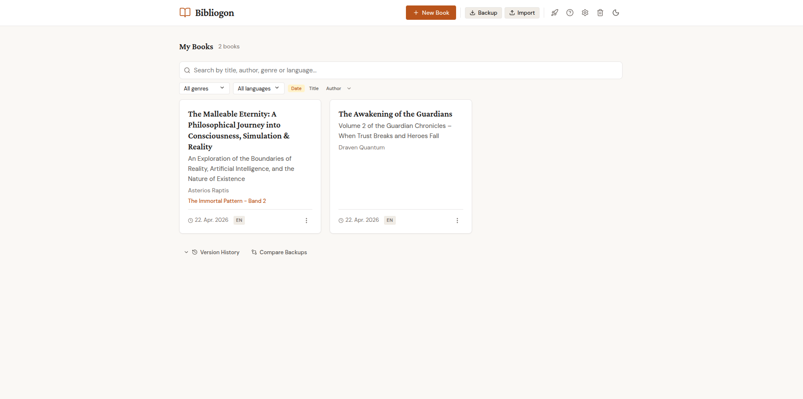
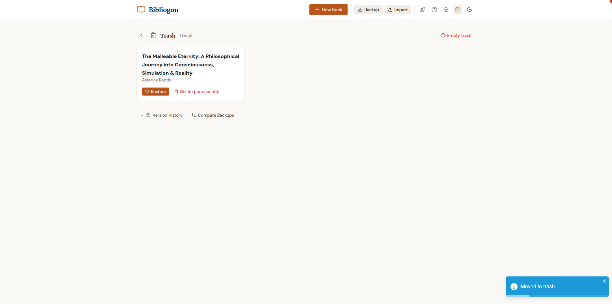

# Getting Started

> **Prefer a click-and-run install?** The desktop launcher for Windows, macOS, and Linux is documented under [Installation](installation.md). This page covers the terminal-based path plus the post-install orientation.

## Installation

Topos runs as a set of Docker containers on your own machine. Your books, settings, and exports stay local; nothing is uploaded to a service.

### Prerequisites

You need [Docker](https://docs.docker.com/get-docker/) installed and running before you can start Topos. Docker Desktop (Windows, macOS) or Docker Engine with Compose (Linux) both work.

### Quick install (recommended)

The one-line installer downloads Topos to `~/topos`, builds the Docker images, and starts the app.

```bash
curl -fsSL https://raw.githubusercontent.com/astrapi69/topos/main/install.sh | bash
```

When the installer finishes, open [http://localhost:7880](http://localhost:7880) in your browser.

### Manual install

If you prefer to clone the repository yourself:

```bash
git clone https://github.com/astrapi69/pluginforge-app-template.git
cd topos
./start.sh
```

`start.sh` builds the images on first run, then launches the same Docker stack the one-liner uses. The app is reachable at [http://localhost:7880](http://localhost:7880).

## Running Topos

Once installed, Topos is controlled with two scripts in the install directory.

| Action  | Command                            |
| ------- | ---------------------------------- |
| Stop    | `cd ~/topos && ./stop.sh`      |
| Start   | `cd ~/topos && ./start.sh`     |
| Restart | `./stop.sh && ./start.sh`          |

Stopping the app keeps your data on disk; starting it again brings everything back as it was.

## Uninstalling

To remove Topos and all local data:

```bash
cd ~/topos && ./stop.sh
cd ~ && rm -rf ~/topos
```

This stops the containers and deletes the install directory, including the SQLite database, uploaded assets, and any exports stored under `~/topos`. Make a backup first if you want to keep your books (Dashboard > **Backup**).

## Optional: PDF export with Pandoc

EPUB, Word, HTML, and Markdown exports work out of the box. PDF export needs [Pandoc](https://pandoc.org/installing.html) installed inside the Docker container; it is bundled with the default image, so most users do not need to install anything extra. If you build your own image without Pandoc, PDF export will fail with a clear error message in the export dialog.

## For developers

Working on Topos itself uses a different setup based on `make install` (Poetry + npm + plugins) and `make dev` (FastAPI on port 8000, Vite on port 5173). The `make prod` target runs the same Docker stack as `./start.sh`. See the [README](https://github.com/astrapi69/pluginforge-app-template#development) and [CLAUDE.md](https://github.com/astrapi69/pluginforge-app-template/blob/main/CLAUDE.md) for the full development guide.

## First start

When you open [http://localhost:7880](http://localhost:7880) for the first time the database is empty. Topos uses SQLite as a local database; all data lives on your machine, no external server is required. From Settings you can change language and theme. Six themes (Warm Literary, Cool Modern, Nord, Classic, Studio, Notebook) are available, each with light and dark variants - see the Themes page for details.

## Dashboard: filter, sort, trash

As your collection grows, the Dashboard offers search, filter, and sort controls above the book grid. You can search by title, author, genre, or language, filter by genre and language, and sort by date, title, or author in either direction.



Deleted books go to the Trash (soft delete). The Trash view lists them with three actions: **Restore** puts a book back in the library, **Delete permanently** removes the book and its files immediately, **Empty trash** clears everything at once. Books in the Trash are automatically deleted after 90 days; the timer can be configured in Settings.



## Creating your first book

On the Dashboard, click **New Book**. A two-step dialog opens: in the first step you enter title and author; in the second (expandable via "More details") you can fill in optional fields such as genre, subtitle, language, and series. Only title and author are required.

After creating the book you are sent straight to the editor. The sidebar lets you add chapters. Each chapter has a title and a chapter type (e.g. Chapter, Foreword, Afterword, Glossary). Chapter order is changeable by drag-and-drop in the sidebar. Just start writing - the editor saves your changes automatically.

## Importing existing projects

If you already have a book project in write-book-template format, you can import it directly. On the Dashboard, click **Import** and select the corresponding ZIP file. Topos reads the chapter structure, metadata (title, author, ISBN, language) and assets (images, cover) automatically and creates the book with everything intact.

Backups can be restored the same way. A backup (.bgb file) contains the entire state of all books. From the Dashboard you export the current state via **Backup** and restore it via **Restore**.
