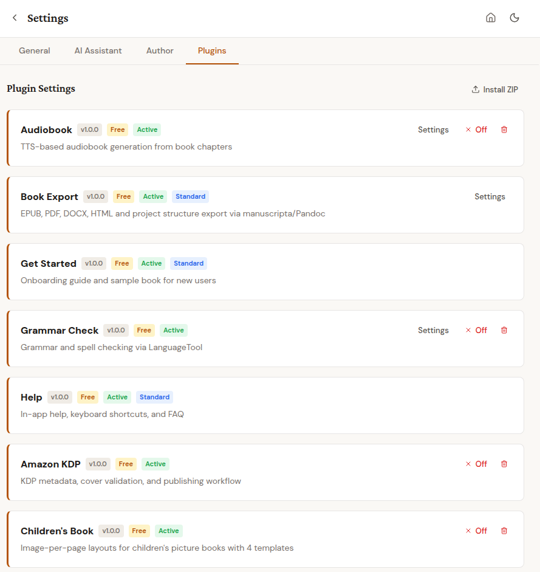

# Plugins Overview

Topos uses a modular plugin architecture based on PluginForge (pluggy). All plugins are free and can be used without restrictions.

Plugins register automatically at startup and provide API endpoints and UI extensions via a frontend manifest. Third-party plugins can be installed as ZIP files through Settings > Plugins. Each plugin declares UI slots (sidebar actions, toolbar buttons, editor panels, settings sections, export options) without modifying the application core.

